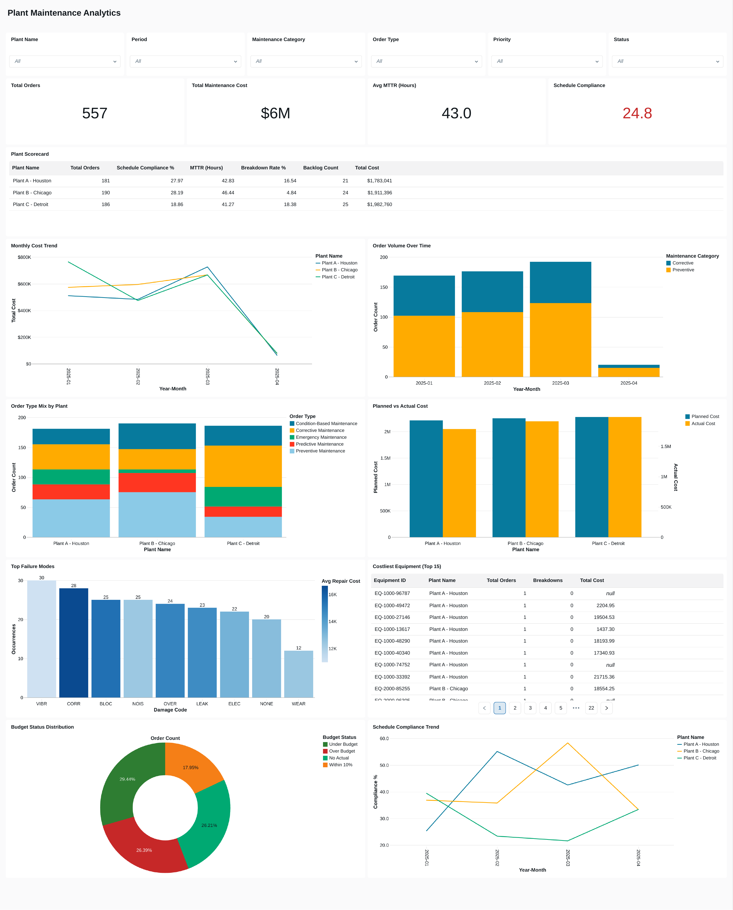

# SAP Plant Maintenance Analytics — Databricks Free Edition

An end-to-end data analytics project built on **Databricks Free Edition** that processes mock SAP Planned Maintenance (PM) data from 3 manufacturing plants through a Medallion Architecture pipeline (Bronze → Silver → Gold), with data quality validation, KPI computation, interactive dashboards, and Genie-powered natural language analytics.


---

## Dashboard Preview



**Interactive Databricks SQL Dashboard** with 10 visualizations and 6 global filters (Plant Name, Period, Maintenance Category, Order Type, Priority, Status). Every chart reacts dynamically as filters change.

**Key findings from the data:**
- 557 work orders across 3 plants, $6M total maintenance cost
- Average MTTR of 43 hours with Plant C showing the highest breakdown rate (18.4%)
- Schedule compliance at 24.8% (target: >90%) — significant room for improvement across all plants
- Top failure modes: vibration, corrosion, and blocking account for ~45% of all breakdowns

---

## Architecture

```
┌─────────────────────────────────────────────────────────────────────┐
│  SOURCE                                                             │
│  39 Excel files: PlantA_Jan2025_Week1.xlsx ...                      │
│  3 Plants × 13 Weeks × ~15 records each                             │
└────────────────────┬────────────────────────────────────────────────┘
                     │ Data Ingestion (Upload to Volume)
                     ▼
┌─────────────────────────────────────────────────────────────────────┐
│  UNITY CATALOG VOLUME                                               │
│  /Volumes/workspace/default/sap_pm_data/                            │
└────────────────────┬────────────────────────────────────────────────┘
                     │ Notebook 01: Ingest (read as strings)
                     ▼
┌─────────────────────────────────────────────────────────────────────┐
│  BRONZE LAYER          workspace.sap_pm.bronze_pm_orders            │
│  Raw data, as-is from Excel + filename metadata (all strings)       │
└────────────────────┬────────────────────────────────────────────────┘
                     │ Notebook 02: DQ Checks → dq_results table
                     │ Notebook 03: Filter & Deduplicate
                     ▼
┌─────────────────────────────────────────────────────────────────────┐
│  SILVER LAYER          workspace.sap_pm.silver_pm_orders            │
│  Cleaned, validated, deduplicated                                   │
└────────────────────┬────────────────────────────────────────────────┘
                     │ Notebook 04: Type cast + aggregate + KPIs
                     ▼
┌─────────────────────────────────────────────────────────────────────┐
│  GOLD LAYER (5 tables)                                              │
│                                                                     │
│  gold_orders_fact ─── Order-level fact with proper types + flags    │
│  gold_plant_metrics ─ Plant scorecard (compliance, MTTR, PM:CM)     │
│  gold_monthly_trends  Monthly aggregates for time-series charts     │
│  gold_failure_analysis Damage codes, causes, repair cost/duration   │
│  gold_equipment_summary Equipment hot spots & cost drivers          │
└────────────────────┬────────────────────────────────────────────────┘
                     │
              ┌──────┴──────┐
              ▼             ▼
     ┌──────────────┐ ┌──────────────┐
     │  Dashboard   │ │    Genie     │
     │  10 visuals  │ │  Natural     │
     │  6 filters   │ │  Language    │
     │  KPIs, trends│ │  Q&A over    │
     │  failures    │ │  Gold tables │
     └──────────────┘ └──────────────┘
```

---

## Design Decision: Strings-First Ingestion

Excel files often have slightly different inferred types across batches (a column that's all integers in one file might have an empty cell in another, flipping it to float). When unioning 39 files, this causes schema-mismatch errors.

**Solution:** Read every column as a string in Bronze, then cast to proper types in `gold_orders_fact`. This is a common pattern in production pipelines and keeps Bronze lossless.

```python
# In 01_Ingest_Raw_Data.py
pdf = pd.read_excel(local_path, dtype=str)   # All columns as strings
```

```sql
-- In 04_Gold_Metrics.sql (gold_orders_fact)
CAST(Planned_Cost_USD AS DOUBLE) AS Planned_Cost_USD,
TO_DATE(Created_Date, 'yyyy-MM-dd') AS created_date,
UNIX_TIMESTAMP(Actual_End_Date, 'yyyy-MM-dd HH:mm')  -- for duration calculations
```

---

## Repository Contents

| File | Purpose |
|------|---------|
| `01_Ingest_Raw_Data.py` | Bronze layer — reads all 39 Excel files as strings, extracts filename metadata |
| `02_Data_Quality_Checks.sql` | 8 DQ validation rules producing a scorecard (includes `CAST` for numeric checks) |
| `03_Silver_Cleansing.py` | Filters bad records and deduplicates → Silver table |
| `04_Gold_Metrics.sql` | Casts types and builds 5 Gold tables (fact + 4 aggregates) |
| `PlantX_<Month><Year>_Week<N>.xlsx` | 39 mock SAP PM data files (3 plants × 13 weeks) |
| `dashboard_preview.png` | Full dashboard screenshot |
| `README.md` | This file |
| `LICENSE` | MIT license |
| `.gitignore` | Standard Python/OS ignores |

---

## Data Overview

### 3 Plants with Distinct Profiles

| Plant | Code | Location | Equipment Age | Behavior |
|-------|------|----------|---------------|----------|
| A | 1000 | Houston | Mixed | Balanced maintenance mix |
| B | 2000 | Chicago | Newer | Heavy preventive maintenance |
| C | 3000 | Detroit | Aging | High corrective & emergency orders, more cost overruns |

### File Naming Convention
```
Plant{A|B|C}_{Mon}{Year}_Week{N}.xlsx
Example: PlantA_Jan2025_Week1.xlsx
```

### 30 SAP PM-style Columns
`Order_Number`, `Order_Type`, `Order_Type_Desc`, `Plant`, `Plant_Name`, `Functional_Location`, `Equipment_ID`, `Priority`, `Priority_Desc`, `Maintenance_Plan`, `Activity_Type`, `Activity_Type_Desc`, `Status`, `Status_Desc`, `Work_Center`, `Planner_Group`, `Cost_Center`, `Created_Date`, `Planned_Start_Date`, `Planned_End_Date`, `Actual_Start_Date`, `Actual_End_Date`, `Planned_Cost_USD`, `Actual_Cost_USD`, `Planned_Labor_Hours`, `Actual_Labor_Hours`, `Damage_Code`, `Cause_Code`, `Breakdown_Indicator`, `Notification_Number`

### Embedded Data Quality Issues (Intentional)
The mock data includes realistic issues to exercise the DQ layer:
- Duplicate `Order_Number` entries
- Invalid priority codes (value `5` outside range 1-4)
- `Planned_Start_Date` after `Planned_End_Date`
- Negative `Actual_Cost_USD` values
- Missing `Planned_Cost_USD` and `Equipment_ID` fields

**Note:** The low schedule compliance (24.8%) is also by design — the generator simulates underperforming plants to showcase the analytics catching real operational issues.

---

## Gold Layer Tables

### `gold_orders_fact` — Dashboard-ready fact table
Every order with all filterable dimensions and pre-computed metrics:
- **Dimensions:** Plant, Date (year_month, week), Order Type, Priority, Status, Equipment, Damage Code
- **Computed fields:** `maintenance_category` (Preventive/Corrective), `schedule_status` (On Time/Late/In Progress), `budget_status` (Under Budget/Within 10%/Over Budget), `cost_variance_pct`, `labor_efficiency_pct`, `actual_duration_hours`

### `gold_plant_metrics` — Plant KPI scorecard

| Metric | Description |
|--------|-------------|
| `schedule_compliance_pct` | % orders completed on or before planned end date |
| `pm_cm_ratio` | Preventive to corrective ratio (>2.0 = world-class) |
| `mttr_hours` | Mean Time To Repair for corrective orders |
| `breakdown_rate_pct` | % of orders that were emergency breakdowns |
| `avg_cost_variance_pct` | Avg budget overrun/underrun percentage |
| `backlog_count` | Open work orders (Created or Released status) |
| `p90_duration_hours` | 90th percentile repair duration |

### `gold_monthly_trends` — Time-series metrics
Order count, cost, breakdowns, compliance by plant × month × maintenance category.

### `gold_failure_analysis` — Reliability patterns
Damage codes, root causes, average and P90 repair cost/hours for corrective orders.

### `gold_equipment_summary` — Equipment hot spots
Total orders, breakdowns, cost, and failure mode diversity per equipment ID.

---

## Dashboard Visuals

10 tiles with 6 interactive filters (Plant, Period, Maintenance Category, Order Type, Priority, Status):

| Tile | Type | Source Table |
|------|------|-------------|
| Total Orders | KPI Counter | `gold_plant_metrics` |
| Total Maintenance Cost | KPI Counter | `gold_plant_metrics` |
| Avg MTTR (Hours) | KPI Counter | `gold_plant_metrics` |
| Schedule Compliance | KPI Counter | `gold_plant_metrics` |
| Plant Scorecard | Table | `gold_plant_metrics` |
| Monthly Cost Trend | Line chart | `gold_monthly_trends` |
| Order Volume Over Time | Stacked bar | `gold_monthly_trends` |
| Order Type Mix by Plant | Stacked bar | `gold_orders_fact` |
| Planned vs Actual Cost | Grouped bar | `gold_plant_metrics` |
| Top Failure Modes | Horizontal bar | `gold_failure_analysis` |
| Costliest Equipment (Top 15) | Table | `gold_equipment_summary` |
| Budget Status Distribution | Donut | `gold_orders_fact` |
| Schedule Compliance Trend | Line chart | `gold_monthly_trends` |

---

## Getting Started

### Prerequisites
- Databricks Free Edition account ([sign up here](https://www.databricks.com/try-databricks))
- Serverless Starter Warehouse (included with Free Edition)

### Setup Steps

1. **Upload data** — In Databricks, use **Data Ingestion** → upload all 39 `PlantX_*.xlsx` files to a Unity Catalog Volume (e.g., `/Volumes/workspace/default/sap_pm_data/`).

2. **Create schema** — In SQL Editor, run:
   ```sql
   CREATE SCHEMA IF NOT EXISTS workspace.sap_pm;
   ```

3. **Import notebooks** — Download the 4 notebook files from this repo and import them into a Workspace folder in Databricks.

4. **Update the volume path** — Open `01_Ingest_Raw_Data.py` in Databricks. Update `VOLUME_PATH` to your actual volume path (find it in Catalog browser).

5. **Run notebooks in order:**
   ```
   01_Ingest_Raw_Data.py       → Creates Bronze table
   02_Data_Quality_Checks.sql  → Creates DQ results table
   03_Silver_Cleansing.py      → Creates Silver table
   04_Gold_Metrics.sql         → Creates 5 Gold tables
   ```

6. **Build dashboard** — In Dashboards, create a new dashboard, add the Gold tables as datasets, add visualization tiles (see table above), and connect filters to relevant datasets.

7. **Set up Genie** — Create a Genie Space with all 5 Gold tables as trusted assets. See the Genie Configuration section below.

---

## Genie Space Configuration

### Setup
1. Click **Genie** in the left sidebar → **New**
2. Name: **SAP PM Maintenance Assistant**
3. Compute: Serverless Starter Warehouse
4. Add 5 trusted tables from `workspace.sap_pm`: `gold_orders_fact`, `gold_plant_metrics`, `gold_monthly_trends`, `gold_failure_analysis`, `gold_equipment_summary`

### Table Descriptions

**gold_orders_fact:** Order-level fact table with every maintenance work order. Contains all filterable dimensions (Plant, Date, Order Type, Priority, Status, Equipment) and pre-computed metrics (cost variance, labor efficiency, duration, schedule status, budget status). Use this as the primary table for detailed analysis and drill-downs.

**gold_plant_metrics:** Plant-level KPI scorecard. One row per plant with schedule compliance, MTTR, PM:CM ratio, breakdown rate, backlog, cost totals, duration percentiles, and labor efficiency.

**gold_monthly_trends:** Monthly aggregated metrics by plant, maintenance category, and order type. Use for time-series trends of cost, volume, compliance, and breakdowns.

**gold_failure_analysis:** Failure patterns for corrective orders. Damage codes, root causes, average and P90 repair cost/hours. Use for reliability and root cause analysis.

**gold_equipment_summary:** Equipment-level summary showing total orders, breakdowns, cost, and failure modes per equipment ID. Use to identify problem equipment.

### Key Column Descriptions

| Column | Description |
|--------|-------------|
| `maintenance_category` | Either 'Preventive' (PM01, PM03, PM04) or 'Corrective' (PM02, PM05) |
| `pm_cm_ratio` | Ratio of preventive to corrective orders. >2.0 = world-class, <1.0 = mostly reactive |
| `schedule_status` | 'On Time' if completed by planned date, 'Late' if after, 'In Progress' if still open |
| `budget_status` | 'Under Budget', 'Within 10%', or 'Over Budget' based on actual vs planned cost |
| `cost_variance_pct` | Percentage difference between actual and planned cost. Positive = over budget |
| `mttr_hours` | Mean Time To Repair in hours, for corrective and emergency orders only |
| `p90_duration_hours` | 90th percentile repair duration — the worst 10% take longer than this |
| `is_breakdown` | 1 if emergency breakdown, 0 otherwise. Sum for breakdown count |
| `is_backlog` | 1 if order status is Created or Released (open work). Sum for backlog count |
| `schedule_compliance_pct` | % of orders completed on/before planned end date. Target >90% |
| `breakdown_rate_pct` | % of all orders that were emergency breakdowns. Lower = better |

### Sample Questions to Add as Starters

1. Which plant has the highest breakdown rate?
2. Compare schedule compliance across all three plants
3. What is the PM to CM ratio for each plant and is it world-class?
4. Show the monthly cost trend by plant
5. What are the top 5 most expensive damage codes?
6. Which equipment IDs have the most breakdowns?
7. Show orders over budget by plant and maintenance category
8. What is the P90 repair duration for each plant?
9. How does cost per preventive order compare to corrective?
10. Show backlog count trend by month and plant

---

## Weekly Refresh Process

```
1. Upload new weekly files to your Volume via Data Ingestion
2. Re-run notebooks 01 → 02 → 03 → 04 (takes ~2-3 minutes total)
3. Dashboard and Genie auto-refresh (live queries against Gold tables)
```

---

## Technologies Used

| Technology | Purpose |
|-----------|---------|
| **Databricks Free Edition** | Platform (serverless compute, Unity Catalog) |
| **Delta Lake** | Table storage format (ACID, time travel) |
| **Unity Catalog** | Data governance, schema management |
| **Spark SQL** | Data transformations and aggregations |
| **PySpark + pandas** | Excel ingestion and data processing |
| **Databricks SQL Dashboard** | Interactive visualizations with filters |
| **Genie** | Natural language analytics over Gold tables |
| **Medallion Architecture** | Bronze → Silver → Gold data organization |

---

## License

This project is for educational and portfolio purposes. The mock data is synthetically generated and does not represent any real organization.
